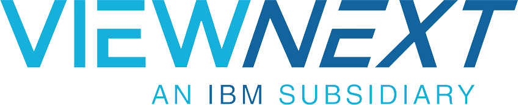
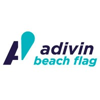
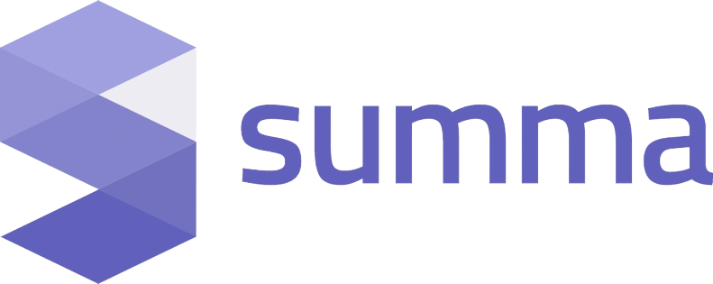
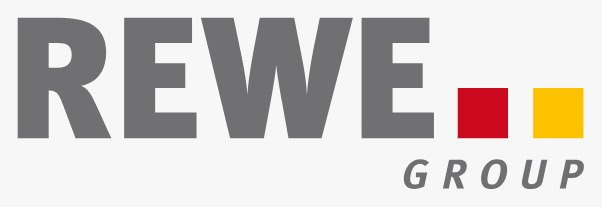
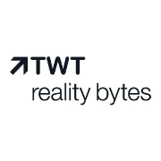

# Proyectos DAW 2022

En este repositorio se encuentra centralizada toda la información relativa a los **Proyectos de Desarrollo de Aplicaciones Web del IES Campanillas** (proyectos de fin de ciclo), en la convocatoria del año 2022.

## Requisitos y criterios a seguir

Tanto los criterios generales como los criterios particulares por cada módulo se encuentran en [la Wiki de este repositorio](https://github.com/IESCampanillas/proyectos-daw-2022/wiki).

## Índice a los proyectos de cada alumno

A continuación se listan los enlaces a los repositorios de GitHub donde están los proyectos. 

Cada alumno debe añadir su **apellido** y **nombre** por **orden alfabético** junto con el **título del proyecto**, seguido del **título del proyecto** y un enlace directo al repositorio (no a la página de Github del alumno). 

Cada alumno debe editar este fichero para incluir sus datos. Se ruega respetar el orden de lista.

* Apellidos, Nombre - [Nombre del proyecto](https://github.com/nombre_del_repositorio)
* Francisco Javier Aranda Jiménez - [ViewGym](https://github.com/PacoAranda/ViewGym)
* Ismael Armada González - [Knox](https://github.com/Archerus35/KNOX.git)
* Ián Banderas Tomillo - [FoodLovers](https://github.com/ianbanderas/ProjectoDAW)
* Samuel Blanco Palmero - [SpaceBP](https://github.com/samubp10/SpaceBP)
* Gheorghe Bucurici - [The Wise Owl](https://github.com/GheorgheBci/TheWiseOwl)
* Rubén Galán Pérez - [World Job](https://github.com/rubengalan97/World_Job)
* Isabel Gómez de Travecedo Méndez - [S.T.I.C.K.E.R.S](https://github.com/isa-gdt/S.T.IC.K.E.R.S)
* Sebastián González Ríos - [Freedom](https://github.com/SrCbas/Freedom)
* Juan Pedro Mancera Taboada - [Shisha Word](https://github.com/juan2pedro/ShishaWordV2)
* César Julio Martín González - [MyTasks](https://github.com/cesarjulio19/MyTasks)
* Pablo Mérida Egea - [FitMe](https://github.com/Pablomerida2001/FitMe)
* María Teresa Milánes Barroso - [StoryFactory](https://github.com/MTeresaMB/TFC/tree/master/storyfactory)
* Javier Moreno Aguilera - [Kubin](https://github.com/javmoreno-developer/Kubin)
* Nicolás Moreno Sánchez - [Miskatonic](https://github.com/nicoms13/django)
* José Manuel Morón Jurado -[SpaceNeo](https://github.com/JMMJ0/Space-NEO)
* Jorge Muñoz Cabrera - [Lizard](https://github.com/jorgeMunozCampanillas/Lizard/blob/main/README.md)
* Jesús María Olalla Pérez - [NaturXtrem](https://github.com/Jeolpe/NaturXtrem)
* Álvaro Ramírez Escribano - [ChadHotel](https://github.com/DawAlvaro/ChadHotel)
* Francisco Javier Rriveros Racero - [CryptoAway](https://github.com/FJ-Riveros/CryptoAway)
* Ariel Hernán Rojas Favero - [reservas](https://github.com/ArielHernan/proyectoFinal)

## 📝 Fechas a tener en cuenta
* Anteproyecto: lunes 4 de abril
* Revisión (checkpoint): viernes 13 de mayo
* Entrega de proyecto: miércoles 22 de junio
* Exposiciones: jueves 23 y viernes 24 de junio de 2022

## ⏰ Cuadrante horario de las exposiciones

Los días de las exposiciones serán el **jueves 23 y el viernes 24 de junio de 2022**. La duración de cada exposición será de 10 minutos (5 de exposición y 5 de preguntas), dejando un margen de otros 5 minutos para el cambio. Se deberá llegar unos 5 minutos antes del inicio de la presentación. Aquellos alumnos que aún no hayan finalizado su FCT, asistirán al centro únicamente para la exposición, debiendo regresar posteriormente a sus prácticas en la empresa.

### :calendar: jueves 23 de junio de 2022

-woBG.png">

* 11:45h [Ismael Armada González]()
* 12:00h [Gheorghe Bucurici]()
* 12:15h [Juan Pedro Mancera Taboada]()
* 12:30h [Maria Teresa Milanés Barroso]()
* 12:45h [Ariel Hernán Rojas Favero]()

### :calendar: viernes 24 de junio de 2022

* 08:15h [Francisco Javier Aranda Jiménez]()
* 08:30h [José Manuel Morón Jurado]()
* 08:45h [Jesús María Olalla Pérez]()
* 09:00h [Francisco Javier Rriveros Racero]()

* 09:15h [Isabel Gómez de Travecedo Méndez]()
* 09:30h [Javier Moreno Aguilera]()

* 09:45h [Sebastián González Ríos]()

* 10:00h [Nicolás Moreno Sánchez]()

* 10:15h [Álvaro Ramírez Escribano]()

* 10:30h [Rubén Galán Pérez]()

* 10:45h [Samuel Blanco Palmero]()

* 11:00h [Jorge Muñoz Cabrera]()

 🥪 D E S C A N S O ☕

* 11:45h [Pablo Mérida Egea]()

* 12:00h [Ián Banderas Tomillo]()

## :school: Lugar de las exposiciones

Las presentaciones tendrán lugar en el **salón de actos** de la [**Incubadora**](https://goo.gl/maps/VGMpWnnpCZJQbP21A) sito en C/ Frederik Termann, 3. 29590, PTA.

Mapa ubicación             | 
:-------------------------:|
 

Si te ha resultado útil este repositorio, por favor dale una :star: ¡Gracias!
